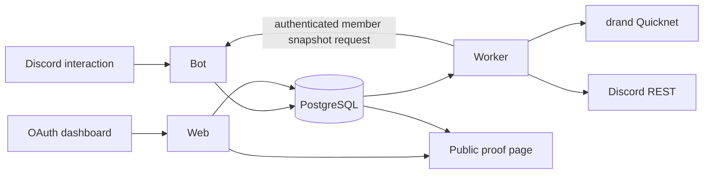

# Architecture

## Services

| Service | Responsibility | Public network |
|---|---|---|
| bot | Discord gateway, slash commands, draft choices, joins/leaves, and fresh targeted member snapshots | No |
| worker | Scheduled lifecycle, Discord REST writes, eligibility snapshots, drand draws, prize roles | No |
| web | Landing page, public evidence, OAuth dashboard, audited action enqueueing | Through Caddy |
| migrate | Applies forward-only SQL migrations and exits | No |
| postgres | Dedicated durable state and job queue | No |

## State flow



## Giveaway lifecycle

```text
queued -> starting -> active -> ending -> ended
   |          |          |         |        |
   +----------+----------+---------+------> deleted
```

`error` is terminal for automatic retries and can be deleted after inspection. A forced start adds an immediate start job; the original scheduled job later becomes a no-op. A forced end and the scheduled end are deduplicated by the pending draw state.

## Consistency

- PostgreSQL is the source of truth.
- The bot never performs lifecycle transitions itself.
- The bot may resolve targeted Discord member batches, but the worker alone
  evaluates and commits draw eligibility and weights.
- Worker jobs are claimed with `FOR UPDATE SKIP LOCKED` and stale locks are recoverable.
- Guild creation capacity uses a transaction-scoped advisory lock.
- Discord message rendering always comes from current persisted state.
- External Discord operations occur after a persisted transition and are safe to retry against that state.

## Network

Only `giveaway-bot-web:3000` joins `vanguard-qc-bot_default`. PostgreSQL, bot, worker, and migrations use the private Compose network. The worker reaches the bot's authenticated member-snapshot endpoint only on that private network. The existing Vanguard Caddy service terminates TLS for `giveaway.leni.cat`.

## Secrets

Doppler injects variables into Compose. No production env file is written to disk by this repository. OAuth values are encrypted before PostgreSQL persistence; session tokens are hashed.
